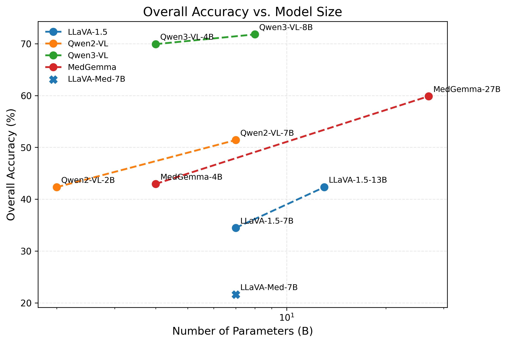
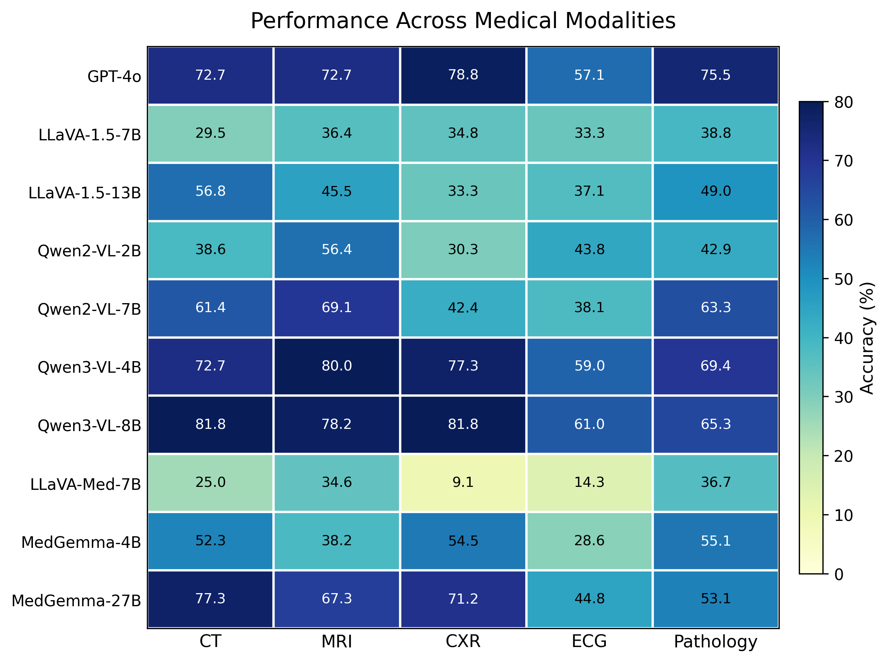
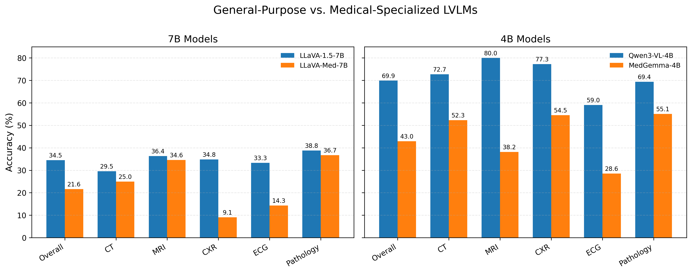

# MultiMed

## GPT-4o

inference:

```bash
# set the API key first
export OPENAI_API_KEY="sk-..."
python GPT_runner.py \
    --stage inference \
    --model gpt-4o \
    --question-file /data/yusenp/Multi_MedVH/Multi_MedVH_QA/Multi_MedVH_QA.json \
    --image-folder /data/yusenp/Multi_MedVH/Multi_MedVH_QA \
    --predictions-file outputs/gpt4o/predictions.jsonl \
    --report-dir outputs/gpt4o/report
```

evaluation:

```bash
python GPT_runner.py \
    --stage evaluate \
    --model gpt-4o \
    --question-file /data/yusenp/Multi_MedVH/Multi_MedVH_QA/Multi_MedVH_QA.json \
    --image-folder /data/yusenp/Multi_MedVH/Multi_MedVH_QA \
    --predictions-file outputs/gpt4o/predictions.jsonl \
    --report-dir outputs/gpt4o/report
```

## LLaVA models

### LLaVA-1.5-7B

Inference: 

```bash
CUDA_VISIBLE_DEVICES=0 taskset -c 11-20 python LLaVA_runner.py \
    --stage inference \
    --model-path liuhaotian/llava-v1.5-7b \
    --question-file /data/yusenp/Multi_MedVH/Multi_MedVH_QA/Multi_MedVH_QA.json \
    --image-folder /data/yusenp/Multi_MedVH/Multi_MedVH_QA \
    --predictions-file outputs/llava15_7b/predictions.jsonl \
    --report-dir outputs/llava15_7b/report \
    --temperature 0
```

evaluation:

```bash
CUDA_VISIBLE_DEVICES=0 taskset -c 11-20 python LLaVA_runner.py \
    --stage evaluate \
    --model-path liuhaotian/llava-v1.5-7b \
    --question-file /data/yusenp/Multi_MedVH/Multi_MedVH_QA/Multi_MedVH_QA.json \
    --image-folder /data/yusenp/Multi_MedVH/Multi_MedVH_QA \
    --predictions-file outputs/llava15_7b/predictions.jsonl \
    --report-dir outputs/llava15_7b/report \
    --temperature 0
```


### LLaVA-1.5-13B

Inference: 

```bash
CUDA_VISIBLE_DEVICES=0 taskset -c 11-20 python LLaVA_runner.py \
    --stage inference \
    --model-path liuhaotian/llava-v1.5-13b \
    --question-file /data/yusenp/Multi_MedVH/Multi_MedVH_QA/Multi_MedVH_QA.json \
    --image-folder /data/yusenp/Multi_MedVH/Multi_MedVH_QA \
    --predictions-file outputs/llava15_13b/predictions.jsonl \
    --report-dir outputs/llava15_13b/report \
    --temperature 0
```

evaluation:

```bash
CUDA_VISIBLE_DEVICES=0 taskset -c 11-20 python LLaVA_runner.py \
    --stage evaluate \
    --model-path liuhaotian/llava-v1.5-13b \
    --question-file /data/yusenp/Multi_MedVH/Multi_MedVH_QA/Multi_MedVH_QA.json \
    --image-folder /data/yusenp/Multi_MedVH/Multi_MedVH_QA \
    --predictions-file outputs/llava15_13b/predictions.jsonl \
    --report-dir outputs/llava15_13b/report \
    --temperature 0
```

### LLaVAMed-1.5-7B

inference:

```bash
CUDA_VISIBLE_DEVICES=0 taskset -c 11-20 python LLaVA_runner.py \
    --stage inference \
    --model-path microsoft/llava-med-v1.5-mistral-7b \
    --question-file /data/yusenp/Multi_MedVH/Multi_MedVH_QA/Multi_MedVH_QA.json \
    --image-folder /data/yusenp/Multi_MedVH/Multi_MedVH_QA \
    --predictions-file outputs/llava_med15_7b/predictions.jsonl \
    --report-dir outputs/llava_med15_7b/report \
    --temperature 0
```

evaluation:

```bash
CUDA_VISIBLE_DEVICES=0 taskset -c 11-20 python LLaVA_runner.py \
    --stage evaluate \
    --model-path microsoft/llava-med-v1.5-mistral-7b \
    --question-file /data/yusenp/Multi_MedVH/Multi_MedVH_QA/Multi_MedVH_QA.json \
    --image-folder /data/yusenp/Multi_MedVH/Multi_MedVH_QA \
    --predictions-file outputs/llava_med15_7b/predictions.jsonl \
    --report-dir outputs/llava_med15_7b/report \
   --temperature 0
```


## QwenVL models

### Qwen2VL 2B

inference:

```bash
python QwenVL_runner.py \
    --stage inference \
    --model-path Qwen/Qwen2-VL-2B-Instruct \
    --question-file /data/yusenp/Multi_MedVH/Multi_MedVH_QA/Multi_MedVH_QA.json \
    --image-folder /data/yusenp/Multi_MedVH/Multi_MedVH_QA \
    --predictions-file outputs/qwen2vl_2b/predictions.jsonl \
    --report-dir outputs/qwen2vl_2b/report \
    --dtype bfloat16 \
    --temperature 0
```

evaluation:

```bash
python QwenVL_runner.py \
    --stage evaluate \
    --model-path Qwen/Qwen2-VL-2B-Instruct \
    --question-file /data/yusenp/Multi_MedVH/Multi_MedVH_QA/Multi_MedVH_QA.json \
    --image-folder /data/yusenp/Multi_MedVH/Multi_MedVH_QA \
    --predictions-file outputs/qwen2vl_2b/predictions.jsonl \
    --report-dir outputs/qwen2vl_2b/report \
    --dtype bfloat16 \
    --temperature 0
```

### Qwen2VL 7B

inference:

```bash
python QwenVL_runner.py \
    --stage inference \
    --model-path Qwen/Qwen2-VL-7B-Instruct \
    --question-file /data/yusenp/Multi_MedVH/Multi_MedVH_QA/Multi_MedVH_QA.json \
    --image-folder /data/yusenp/Multi_MedVH/Multi_MedVH_QA \
    --predictions-file outputs/qwen2vl_7b/predictions.jsonl \
    --report-dir outputs/qwen2vl_7b/report \
    --dtype bfloat16 \
    --temperature 0
```

evaluation:

```bash
python QwenVL_runner.py \
    --stage evaluate \
    --model-path Qwen/Qwen2-VL-7B-Instruct \
    --question-file /data/yusenp/Multi_MedVH/Multi_MedVH_QA/Multi_MedVH_QA.json \
    --image-folder /data/yusenp/Multi_MedVH/Multi_MedVH_QA \
    --predictions-file outputs/qwen2vl_7b/predictions.jsonl \
    --report-dir outputs/qwen2vl_7b/report \
    --dtype bfloat16 \
    --temperature 0
```


### Qwen3VL 4B


```bash
python QwenVL_runner.py \
    --stage inference \
    --model-path Qwen/Qwen3-VL-4B-Instruct \
    --question-file /data/yusenp/Multi_MedVH/Multi_MedVH_QA/Multi_MedVH_QA.json \
    --image-folder /data/yusenp/Multi_MedVH/Multi_MedVH_QA \
    --predictions-file outputs/qwen3vl_4b/predictions.jsonl \
    --report-dir outputs/qwen3vl_4b/report \
    --dtype bfloat16 \
    --temperature 0
```

evaluation:

```bash
python QwenVL_runner.py \
    --stage evaluate \
    --model-path Qwen/Qwen3-VL-4B-Instruct \
    --question-file /data/yusenp/Multi_MedVH/Multi_MedVH_QA/Multi_MedVH_QA.json \
    --image-folder /data/yusenp/Multi_MedVH/Multi_MedVH_QA \
    --predictions-file outputs/qwen3vl_4b/predictions.jsonl \
    --report-dir outputs/qwen3vl_4b/report \
    --dtype bfloat16 \
    --temperature 0
```

### Qwen3VL 8B


```bash
python QwenVL_runner.py \
    --stage inference \
    --model-path Qwen/Qwen3-VL-8B-Instruct \
    --question-file /data/yusenp/Multi_MedVH/Multi_MedVH_QA/Multi_MedVH_QA.json \
    --image-folder /data/yusenp/Multi_MedVH/Multi_MedVH_QA \
    --predictions-file outputs/qwen3vl_8b/predictions.jsonl \
    --report-dir outputs/qwen3vl_8b/report \
    --dtype bfloat16 \
    --temperature 0
```

evaluation:

```bash
python QwenVL_runner.py \
    --stage evaluate \
    --model-path Qwen/Qwen3-VL-8B-Instruct \
    --question-file /data/yusenp/Multi_MedVH/Multi_MedVH_QA/Multi_MedVH_QA.json \
    --image-folder /data/yusenp/Multi_MedVH/Multi_MedVH_QA \
    --predictions-file outputs/qwen3vl_8b/predictions.jsonl \
    --report-dir outputs/qwen3vl_8b/report \
    --dtype bfloat16 \
    --temperature 0
```

## MedGemma models


### MedGemma-4B

inference:

```bash
python MedGemma_runner.py \
    --stage inference \
    --model-path google/medgemma-4b-it \
    --question-file /data/yusenp/Multi_MedVH/Multi_MedVH_QA/Multi_MedVH_QA.json \
    --image-folder /data/yusenp/Multi_MedVH/Multi_MedVH_QA \
    --predictions-file outputs/medgemma_4b/predictions.jsonl \
    --report-dir outputs/medgemma_4b/report \
    --dtype bfloat16 \
    --temperature 0
```

evaluation:


```bash
python MedGemma_runner.py \
    --stage evaluate \
    --model-path google/medgemma-4b-it \
    --question-file /data/yusenp/Multi_MedVH/Multi_MedVH_QA/Multi_MedVH_QA.json \
    --image-folder /data/yusenp/Multi_MedVH/Multi_MedVH_QA \
    --predictions-file outputs/medgemma_4b/predictions.jsonl \
    --report-dir outputs/medgemma_4b/report \
    --dtype bfloat16 \
    --temperature 0
```


### MedGemma-27B

inference:

```bash
python MedGemma_runner.py \
    --stage inference \
    --model-path google/medgemma-27b-it \
    --question-file /data/yusenp/Multi_MedVH/Multi_MedVH_QA/Multi_MedVH_QA.json \
    --image-folder /data/yusenp/Multi_MedVH/Multi_MedVH_QA \
    --predictions-file outputs/medgemma_27b/predictions.jsonl \
    --report-dir outputs/medgemma_27b/report \
    --dtype bfloat16 \
    --temperature 0
```

evaluation:


```bash
python MedGemma_runner.py \
    --stage evaluate \
    --model-path google/medgemma-27b-it \
    --question-file /data/yusenp/Multi_MedVH/Multi_MedVH_QA/Multi_MedVH_QA.json \
    --image-folder /data/yusenp/Multi_MedVH/Multi_MedVH_QA \
    --predictions-file outputs/medgemma_27b/predictions.jsonl \
    --report-dir outputs/medgemma_27b/report \
    --dtype bfloat16 \
    --temperature 0
```


## Results


Accuracy-model size tradeoff:




Heatmap by modality/question type:

| by modality | by question type |
| ----------- | ---------------- |
|  |  |


General-Purpose v.s. Domain finetuned models:




